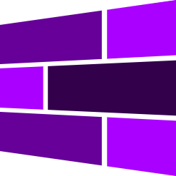

<h1 style="display: flex;align-items: center;">Groove Launcher</h1>

**Groove Launcher** is a metro-styled launcher designed for a customizable and sleek user experience. Users can personalize their launcher by adjusting tile sizes, changing tile positions, customizing the color theme, and setting their favorite wallpapers.

## Features

- **Metro-Style Interface:** A clean & modern design inspired by Windows Phone 8.
- **Customizable Tiles:** Drag and drop tiles, adjust their sizes, and move them around to fit your unique style.
- **Theme Customization:** Change the color of the launcher to match your mood or aesthetic.
- **Wallpaper Personalization:** Choose and set your own wallpapers to create a fully personalized setup.

## Releases

You can download the latest prebuilt APK from the [Releases](https://github.com/groovelauncher/GrooveLauncher/releases) section.

1. Head to the [Releases](https://github.com/groovelauncher/GrooveLauncher/releases) page.
2. Download the APK file.
3. Install it on your Android device.

## Installation

If you prefer to build the app yourself:

1. Clone the repository:

    ```bash
    git clone https://github.com/groovelauncher/GrooveLauncher.git
    ```

2. Navigate to the project directory and run the build script:

    ```bash
    npm run build:production
    ```

3. Open the `./android` folder in Android Studio.
4. Compile and run the app on your device/emulator.

## Usage

1. Open the **Groove Launcher** app.
2. Drag and drop tiles to rearrange them.
3. Long press on a tile to resize it.
4. Swipe left to open the app list and find **Groove Settings**.
5. In **Groove Settings**, you can set a wallpaper or choose an accent color that fits your style!

## Contributing

Contributions are most welcome! Feel free to submit issues and pull requests to help improve **Groove Launcher**.

1. Fork the repository.
2. Create a new branch for your feature or bugfix.
3. Submit a pull request when your code is ready.

## License

This project is licensed under the MIT License - see the [LICENSE](LICENSE) file for details.

## Contact

For any inquiries or feedback, feel free to reach out!

<a href="https://www.buymeacoffee.com/berkaytumal" target="_blank"></a>
