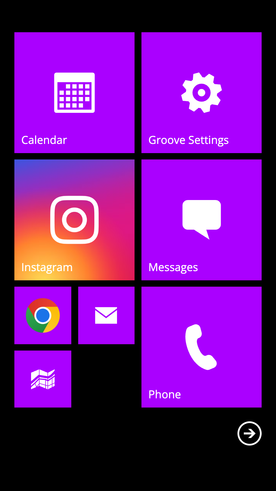
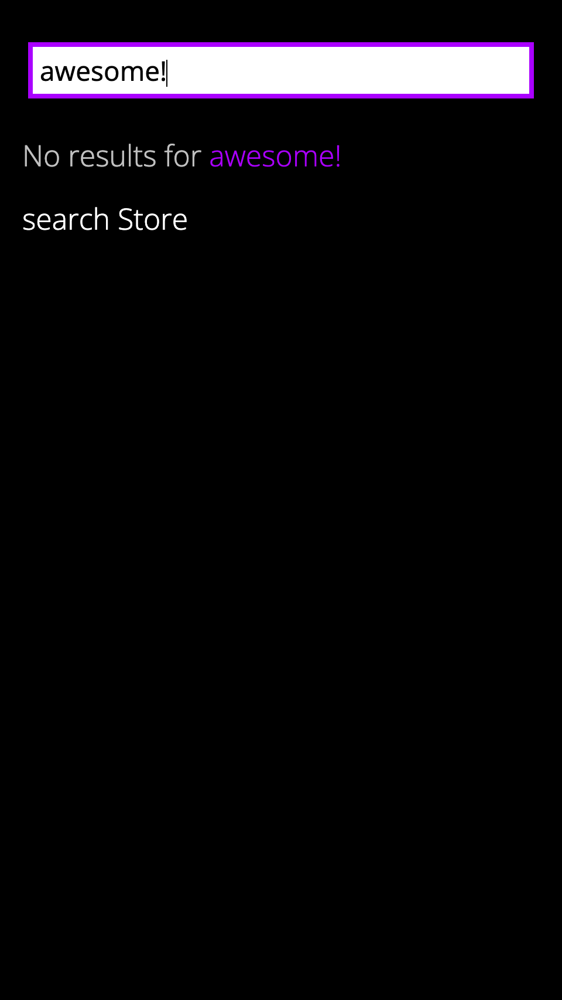
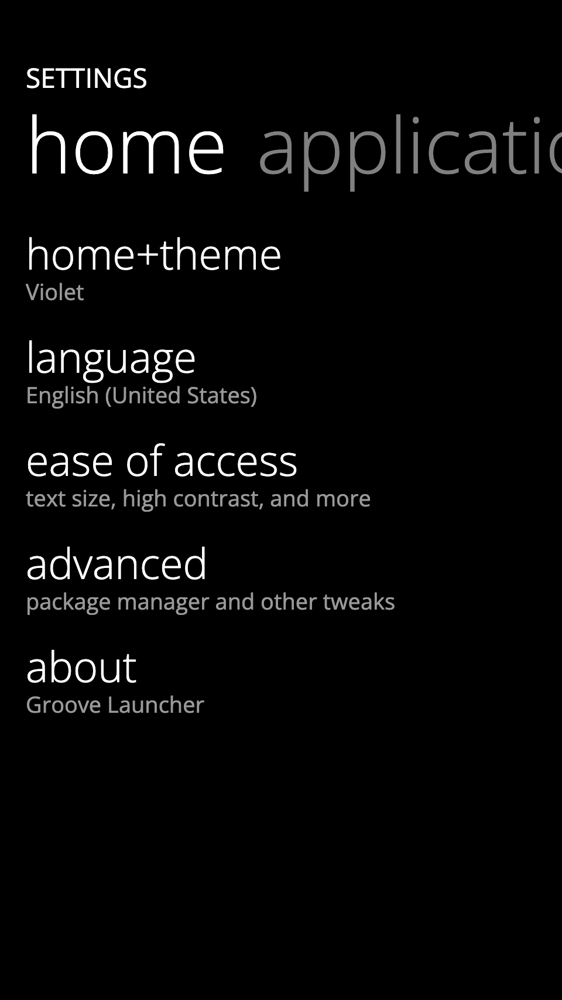
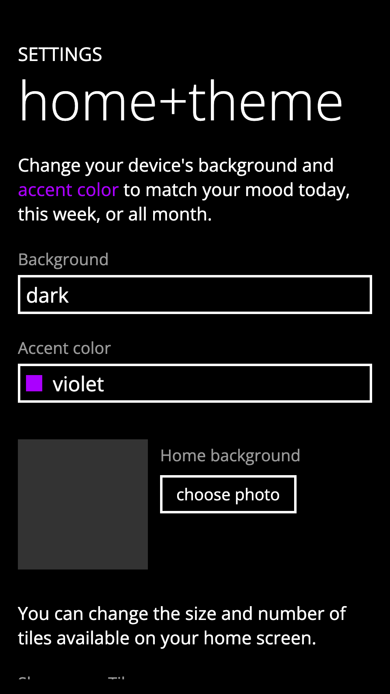
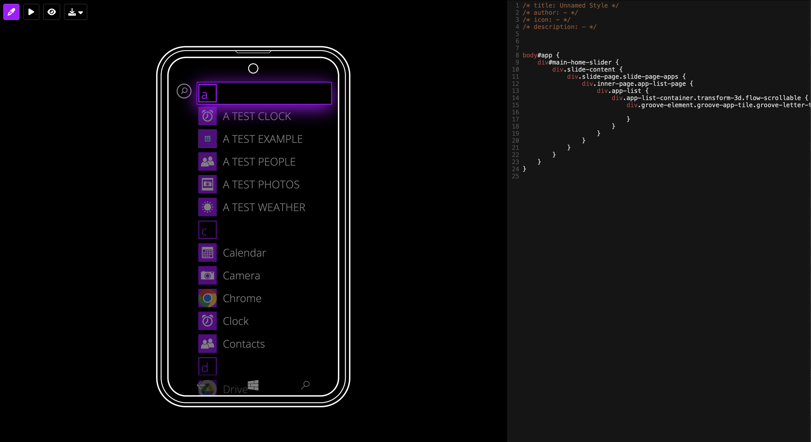

<div align="center">
  
  <h1>Groove Launcher</h1>
  <p>A groovy personalized home screen experience</p>
</div>

**[NEW! Get Themes For Groove Tweaks](THEMES.MD)**
---

**Groove Launcher** is a metro-styled launcher that brings a sleek, customizable, and personal touch to your home screen.  

## Table of Contents
- [Features](#features)
- [Screenshots](#screenshots)
- [Getting Started](#getting-started)
- [Download](#download)
- [Build Instructions](#build-instructions)
- [Groove Tweaks](#groove-tweaks)
   - [Installing Styles](#installing-styles)
   - [Writing Styles for Groove Tweaks](#writing-styles-for-groove-tweaks)
- [Contributing](#contributing)
- [License](#license)
- [Contact](#contact)

## Features  
- **Metro-Style Design**: Inspired by Windows Phone 8 for a clean, modern look.  
- **Customizable Tiles**: Drag, drop, resize, and rearrange tiles to match your style.  
- **Theme Customization**: Change the launcher's colors to fit your vibe.  
- **Wallpaper Support**: Pick your favorite wallpaper to make your setup truly yours.  

## Screenshots

<table>
    <tr>
        <td></td>
        <td></td>
        <td></td>
    </tr>
    <tr>
        <td></td>
        <td></td>
        <td></td>
    </tr>
</table>

## Getting Started  

Groove Launcher makes personalization easy!  

1. **Arrange Tiles**: Drag and drop tiles to arrange them however you like. Long-press tiles to resize them.  
2. **Find Apps**: Swipe left to see your full app list.  
3. **Customize**: Head to Groove Settings to set wallpapers, tweak colors, and more.  

Want to go even further? Check out **Groove Tweaks** to apply custom CSS themes! Explore community-made themes or create your own.  

## Download

You can download the latest prebuilt APK from the [Releases](https://github.com/groovelauncher/GrooveLauncher/releases) section.

## Build Instructions

If you prefer to build the app yourself:

1. Clone the repository:

   ```bash
   git clone https://github.com/groovelauncher/GrooveLauncher.git
   ```

2. Navigate to the project directory and install dependencies:

   ```bash
   npm install
   ```

3. Choose your build option:

   **For Android:**
   ```bash
   npm run build:android    # Builds and installs on connected device
   # OR
   npm run build:production # Builds project only
   ```
   Then open `./android` in Android Studio to compile and run.

   **For Web Testing:**
   ```bash
   npm run debug:web
   ```
   Open `http://localhost:8080/www/` in your browser.


## Groove Tweaks
### Installing Styles

There are two ways to install themes in Groove Launcher:

1. **Via Groove Tweaks:**
    - Open Groove Tweaks
    - Tap the plus button on the app bar
    - Paste the style URL
    - Click Install

2. **Via URL:**
    - Launch a `groove:?installStyle` URL
    - Click Install in the prompt

### Writing Styles for Groove Tweaks

#### Quick Testing
For rapid development and testing, visit:
[Groove Theme Editor](https://editor.groovelauncher.org)
<div align="center">
   
</div>

#### Metadata Requirements
Your CSS file must include the following metadata at the top:
```css
/* title: Your Style Name */
/* author: [Your Name](https://github.com/yourusername) (optional) */
/* icon: https://link-to-your-icon.png (optional) */
/* description: Brief description of your style (optional) */
```

Only the `title` field is mandatory in style definition. Other fields are optional and provide additional metadata:

- `author`: Can be plain text or a markdown link (e.g., `[Author Name](https://example.com)`)
- `description`: Additional details about the style
- `credits`: Attribution to original creators or contributors
- `version`: Style version number
- `date`: Creation or last update date

#### Example CSS Template
```css
/* title: Neon Groove Theme */
/* author: [Example User](https://github.com/example) */
/* icon: https://example.com/neon-icon.png */
/* description: Weird ahh theme for Groove Launcher */

#app {
   background: #0a0a0a;
}
```

#### Hosting Your Style
1. Host your CSS file on any of these platforms:
   - GitHub Gist
   - Any CDN service
   - Your own server

#### Creating Quick Install Links
Use this tool to generate installation links:
[Groove Tweaks Link Generator](https://codepen.io/wellitsucks/full/ogvqZXZ)

To create an installation URL manually:
1. Encode your style URL using `encodeURIComponent()`
2. Add `groove:?installStyle=` before the encoded URL

Example:
```
groove:?installStyle=https%3A%2F%2Fexample.com%2Fstyle.css
```

Note: Groove links only work with Groove Launcher 0.5.5 and up (0.5.4 has a bug that prevents style loading).

## Contributing

Contributions are most welcome! Feel free to submit issues and pull requests to help improve **Groove Launcher**.

1. Fork the repository.
2. Create a new branch for your feature or bugfix.
3. Submit a pull request when your code is ready.

## License

This project is licensed under the MIT License - see the [LICENSE](LICENSE) file for details.

## Contact

For any inquiries or feedback, feel free to reach out!

<a href="https://www.buymeacoffee.com/berkaytumal" target="_blank"></a>
