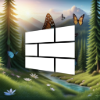

# Groove Tweaks - Theme Gallery
A collection of community-created themes for Groove Launcher.

## Available Themes

| Theme | | Details |
|-|-|-|
|  | **Frutiger Groove** | **Author:** [Berkay Tumal](https://github.com/berkaytumal)   **Description:** Frutiger Aero theme for Groove Launcher     |
|  | **Nothing**       | **Author:** [Berkay Tumal](https://github.com/berkaytumal)   **Description:** Nothing OS inspired theme for Groove Launcher.     |
|  | **Windows 95**       | **Author:** [ghplayer2000](https://github.com/ghplayer2000)   **Description:** Windows 95 Theme     |
|  | **High Contrast**   | **Author:** [Berkay Tumal](https://github.com/berkaytumal)   **Description:** High contrast theme for enhanced visibility and accessibility     |
|  | **Lite Mode**       | **Author:** [Berkay Tumal](https://github.com/berkaytumal)   **Description:** A lightweight theme optimized for older devices with reduced animations     |

---

## Installation

1. Make sure you have Groove Launcher 0.5.4.beta.5 or newer installed.
2. Click the "Install Theme" button on your mobile device.
3. When Groove Tweaks launches, tap "Install" in the theme popup.

## 🎨 Submit Your Theme

Want to create your own theme? Check the [Theme Creation Guide](./README.md#writing-styles-for-groove-tweaks) and submit a pull request to this file if you'd like!